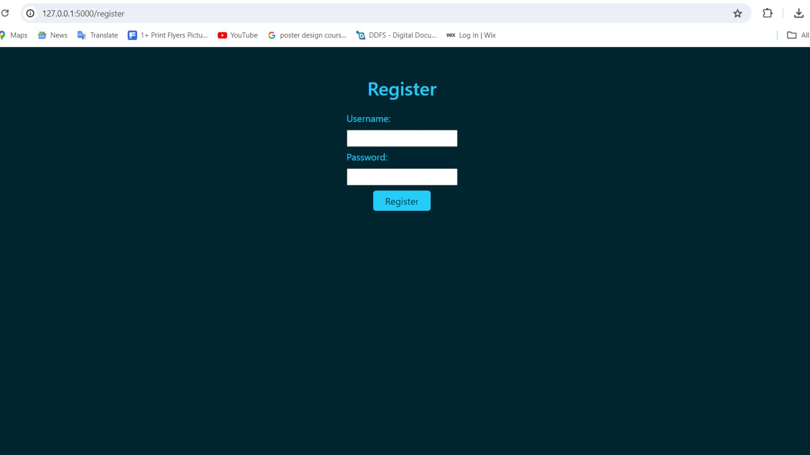
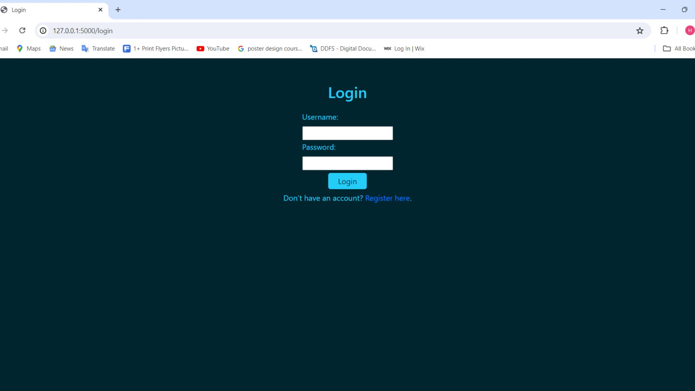
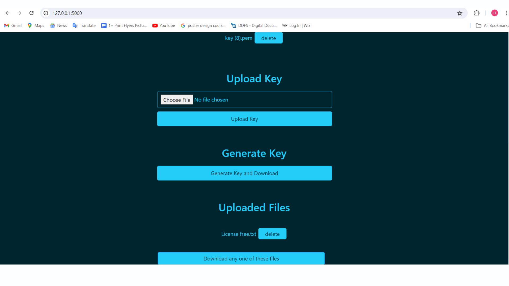

# Cipher Sphere

Cipher Sphere is a Flask-based web application designed to demonstrate secure file and text encryption and decryption. The system ensures confidentiality by encrypting data locally before storage or sharing, making it suitable for cloud environments where security is a priority. Although developed and tested locally, the project represents a scalable model for secure encryption workflows in cloud-based systems.

## Features

- Encrypt and decrypt any type of file (text, images, videos, documents, etc.)
- A unique key is generated for every encryption, and the same key is required for decryption
- User login and authentication system
- Supports multiple strong cryptographic algorithms:
  - AES-CCM
  - AES-GCM
  - MultiFernet
  - ChaCha20-Poly
- Web interface developed using Flask, HTML, CSS, and Bootstrap
- Lightweight interface designed for accessible operation

---

## Tech Stack

| Component    | Technology                   |
| ------------ | ---------------------------- |
| Backend      | Python (Flask)               |
| Frontend     | HTML, CSS, Bootstrap         |
| Cryptography | Python `cryptography` module |
| Runtime      | Python                       |

## Install depedencied

pip install -r requirements.txt

## Start the Flask application

python app.py

## Screenshots

### Home Page

### Encryption Page

### Decryption Page

